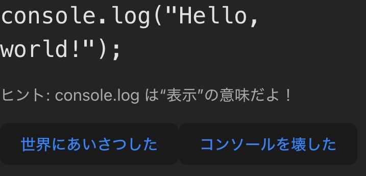
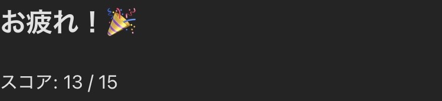

### 📚 JS文法が学べるアプリ「Code Crush」

JavaScriptの基礎文法をクイズ形式で学べるアプリです。  
選択式なので、初心者でもサクサク進められる設計になっています✌️  
ゲーム感覚で解けるから、復習にもおすすめ！

---

#### 🧠 出題例

---

#### ✅ 全問回答後の結果画面

---

👉 **[アプリを使ってみる](https://code-crush-black.vercel.app/)**

---

© @Airi  
This code is for personal and educational use only.  
Commercial use is strictly prohibited.
